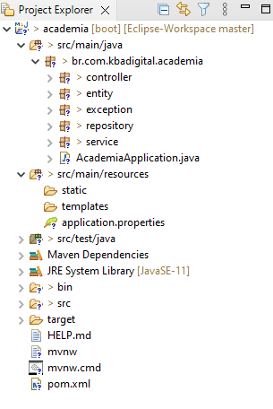
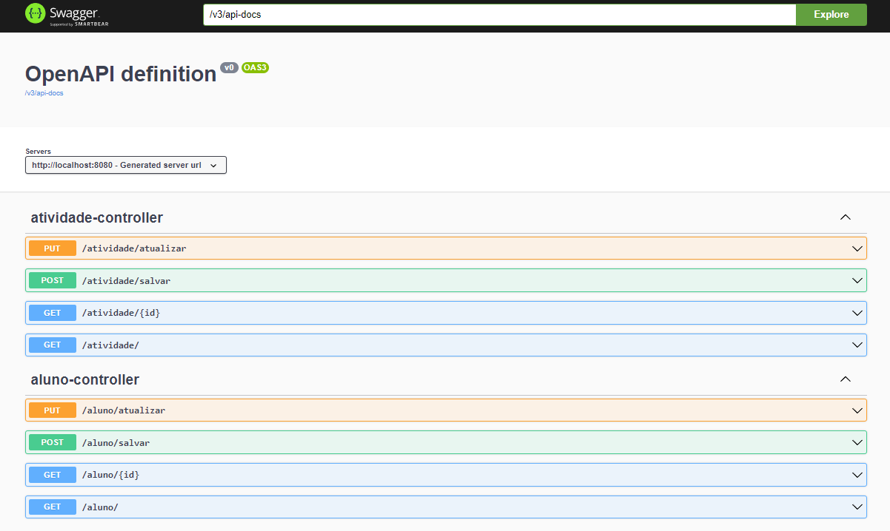

# **Projeto Academia JPA**
## **Spring Boot**

Demonstração de uso de API Rest com Spring Boot e JPA, com a ferramenta Swagger. 
  
## **Tecnologias Utilizadas**

##### Java 11
##### Spring Boot
##### Spring Boot JPA
##### Banco de Dados H2
##### Swagger

## **Organização do Projeto**
####

## **Swagger**
####

## **Autor**

### **Katarine Albuquerque**
**Linkedin:** [/katarine-albuquerque]("https://www.linkedin.com/in/katarine-albuquerque/")

**GitHub:** [/KatarineAlbuquerque]("https://github.com/KatarineAlbuquerque")

**Projetos:** [/my-portfolio]("https://github.com/KatarineAlbuquerque/my-portfolio")
###

